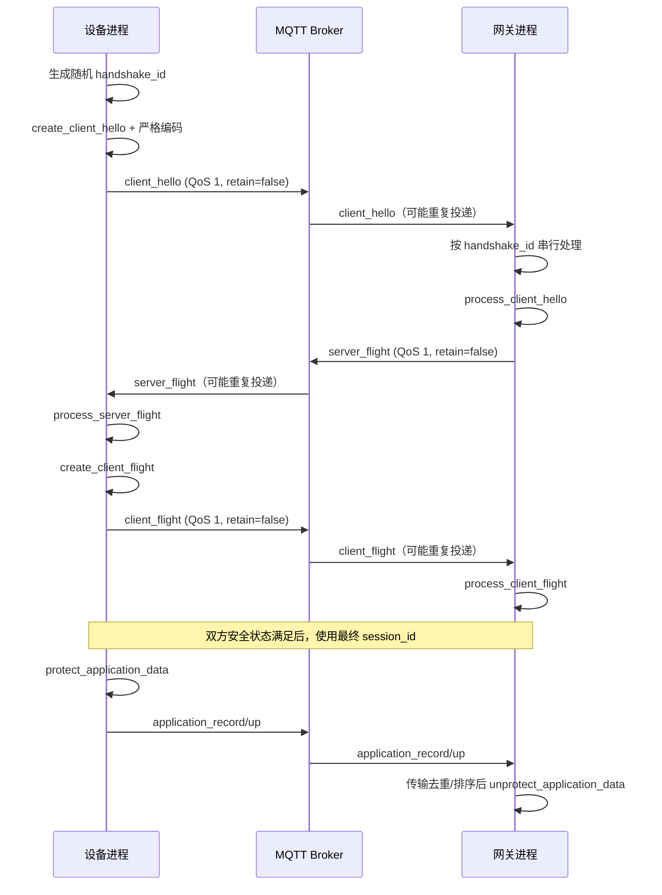

# 成员 B 交付包：MQTT、审计与部署对接草案

项目：面向物联网场景的后量子混合安全通信网关  
文档版本：B-DRAFT-1  
目标安全协议：实验性 `auth-v1`  
状态：供安全主线评审，**不重新定义密码协议**

## 0. 交付物

- `MEMBER_B_DELIVERABLE.md`：主题、字段、时序、重复/乱序策略、审计和部署说明。
- `schemas/mqtt-envelope-v1.schema.json`：MQTT 外层 envelope 的 JSON Schema。
- `schemas/audit-event-v1.schema.json`：结构化审计事件 JSON Schema。
- `examples/*.json`：四类消息及审计事件的非敏感示例。
- `mosquitto/mosquitto.local.conf`：仅供本机演示的 broker 配置。
- `mosquitto/acl.example`、`mosquitto/passwords.example.txt`：ACL 范围及账号创建说明。

## 1. 设计原则与边界

1. MQTT 只承担传输和路由，不改变 `AuthenticatedClientHello`、`AuthenticatedServerFlight`、`AuthenticatedClientFlight`、`SecureRecord` 的密码学含义。
2. 主题、`route_device_id`、`route_gateway_id`、`handshake_id`、`message_id` 都是**未认证的路由元数据**，不得作为身份认证结果。
3. 只有安全模块成功验证签名和 Finished 后，才能把已认证的 `identity_id` 绑定到会话及业务设备。
4. 握手完成前没有最终 `session_id`，因此另设随机 `handshake_id`。
5. `payload_b64u` 是安全主线提供的严格 wire codec 输出。成员 B 的 envelope 层只按字节透传，不自行重排字段、改写默认值或重新计算 transcript。
6. 业务记录必须继续通过 `protect_application_data` / `unprotect_application_data`；不得直接构造记录层、提取密钥、重置序号或忽略认证错误。
7. 所有 envelope 解析采用白名单、长度上限和严格 Schema；未知版本、未知消息类型、额外字段和非规范 Base64URL 均拒绝。

## 2. MQTT 主题表

根前缀固定为 `pqc-iot/v1`。主题中的路由 ID 建议只允许 `[A-Za-z0-9_.-]{1,64}`，不能包含 `/`、`+`、`#`、空白或百分号转义。

| 方向 | message_type | 发布主题模板 | 订阅方 | QoS | Retain |
|---|---|---|---|---:|---|
| 设备→网关 | `client_hello` | `pqc-iot/v1/gateways/{gateway}/handshakes/{handshake_id}/client-hello` | 目标网关 | 1 | false |
| 网关→设备 | `server_flight` | `pqc-iot/v1/devices/{device}/handshakes/{handshake_id}/server-flight` | 发起设备 | 1 | false |
| 设备→网关 | `client_flight` | `pqc-iot/v1/gateways/{gateway}/handshakes/{handshake_id}/client-flight` | 目标网关 | 1 | false |
| 设备→网关 | `application_record` | `pqc-iot/v1/gateways/{gateway}/sessions/{session_id}/records/up` | 目标网关 | 1 | false |
| 网关→设备 | `application_record` | `pqc-iot/v1/devices/{device}/sessions/{session_id}/records/down` | 目标设备 | 1 | false |
| 任意→运维（可选） | `status`（不属于安全协议） | `pqc-iot/v1/status/{component}/{route_id}` | 运维程序 | 1 | 可选 true |

约束：

- 三类握手消息必须分开，不用一个双向共享主题。
- 业务上行/下行必须分开，防止方向混淆，并与记录层方向一致。
- `handshake_id` 采用发起设备生成的 128 位加密随机数，以 32 个小写十六进制字符表示；不能由设备 ID、时间戳或计数器推导。
- `session_id` 必须逐字使用安全模块产生并经 wire codec 暴露的值；envelope/主题不得自行计算。
- 收到消息时，程序必须比较“主题参数”和 envelope 对应字段；不一致时在进入安全模块前拒绝。
- Broker ACL 只能限制某 MQTT 客户端可以发布/订阅哪些路由，不能替代 ML-DSA 身份认证。
- 安全主线完成认证后，必须校验：认证设备身份 ↔ 业务设备 ↔ 当前 MQTT 连接/路由配置是否符合可信映射。路由声明不参与该结论。

## 3. Envelope 字段表

Envelope 使用 UTF-8 JSON，仅为传输外壳。完整约束见 Schema。

| 字段 | 类型 | 必填 | 约束/说明 |
|---|---|---:|---|
| `envelope_version` | string | 是 | 固定 `mqtt-envelope-v1` |
| `protocol_version` | string | 是 | 固定 `auth-v1`；仅用于早期分流，最终以严格解码结果为准 |
| `message_type` | enum | 是 | `client_hello` / `server_flight` / `client_flight` / `application_record` |
| `message_id` | string | 是 | UUID v4；用于传输去重，**不参与身份认证** |
| `route_device_id` | string | 是 | 业务路由声明，不是认证身份 |
| `route_gateway_id` | string | 是 | 业务路由声明，不是认证身份 |
| `handshake_id` | string | 握手消息是 | 32 位小写 hex；三步握手保持一致 |
| `session_id` | string | 业务记录是 | 严格匹配安全模块输出；握手 envelope 不携带最终值 |
| `direction` | enum | 业务记录是 | `device_to_gateway` 或 `gateway_to_device` |
| `record_sequence` | integer | 业务记录是 | 0..16777215；只用于入安全层前的调度/去重，必须与解码后记录一致 |
| `payload_content_type` | string | 是 | 固定 `application/vnd.pqc-iot.auth-v1+binary` |
| `payload_b64u` | string | 是 | 无填充 Base64URL；安全主线严格 codec 所产出的完整消息字节 |

### 3.1 为什么 payload 使用不透明字节

签名输入、transcript、Finished、密钥派生、AAD 和记录字段属于安全主线边界。若 MQTT 层直接把 Python 对象随意变成 JSON，字段顺序、整数编码、默认字段、Unicode 或重复键差异都可能导致双方 transcript 不一致。故正式接入应由安全主线提供：

```python
encode_client_hello(obj) -> bytes
decode_client_hello(data: bytes) -> AuthenticatedClientHello
encode_server_flight(obj) -> bytes
decode_server_flight(data: bytes) -> AuthenticatedServerFlight
encode_client_flight(obj) -> bytes
decode_client_flight(data: bytes) -> AuthenticatedClientFlight
encode_secure_record(obj) -> bytes
decode_secure_record(data: bytes) -> SecureRecord
```

这些函数应固定版本、字段顺序/长度、上限、枚举值与尾随字节规则。MQTT 层不得使用 `pickle`，也不得反射式构造任意 Python 类。

## 4. 消息时序



重要状态点：

- 客户端本地处理完 `server_flight` 并生成 `client_flight`，不等于服务端已经完成握手。
- 服务端只有成功验证 `client_flight` 后才能接收业务记录。
- 可选的“握手已就绪”业务确认不能伪装成第四条密码握手消息；若需要，应在首条受保护应用记录中表达。

## 5. QoS、Retain、重复投递和乱序

### 5.1 推荐设置

- 握手和应用记录：QoS 1。
- Retain：必须 false。旧握手或旧密文不能由 broker 自动发给新进程。
- 不依赖 MQTT `DUP` 标志去重；该标志不足以构成稳定的端到端消息标识。
- 每个设备/网关使用稳定的 MQTT Client ID，并为演示环境启用有限 Session Expiry；应用自身仍须处理重复消息。
- 单个安全会话的消息在同一逻辑连接和固定方向主题上传输；不要把同一方向并发发布到多个连接。
- QoS 2 可作为部署选项，但不能代替应用层去重、严格序号和幂等状态机，且资源成本更高。

### 5.2 握手消息去重状态

键建议为 `(route_gateway_id, handshake_id)`，并在认证后补充已认证身份关联。每个键由单一队列/锁串行调度，缓存：

- 当前预期阶段；
- 每阶段已接受 `message_id`；
- 原始 `payload_b64u` 解码后字节的 SHA-256 摘要（仅用于去重审计，不是认证）；
- 对该输入产生的已编码响应，用于重发；
- 创建、最后活动和超时时间。

处理规则：

1. 第一次合法阶段消息：只调用安全对象一次，缓存结果及响应。
2. 同 `message_id`、同 payload 摘要的重复消息：不再次推进安全对象；重发缓存响应或静默确认。
3. 不同 `message_id`、但同阶段且 payload 完全相同：作为 MQTT/发送方重试处理，不再次推进状态。
4. 同 `message_id` 或同阶段但 payload 不同：判为冲突/可疑消息，拒绝并审计；不得选择其中一条“继续试”。
5. 未到阶段的未来消息：在很小的限额内短暂等待，或直接拒绝；不能越过前置状态。
6. 已完成、失败、关闭或超时的握手对象不可复活。重新连接必须生成新的 `handshake_id` 和新的握手对象。
7. `handshake_id` 冲突到已有但路由组合不同的状态时拒绝，不合并状态。

### 5.3 应用记录去重与严格顺序

现有记录层是严格递增序号且异常会终止会话，因此 MQTT 适配层必须在调用 `unprotect_application_data` **之前**完成调度：

- 每个 `(session_id, direction)` 只有一个串行消费者。
- 维护 `next_expected_sequence` 和一个有界重排缓冲区。
- `seq == next_expected_sequence`：交给记录层；成功后再递增传输侧期望值，并继续释放缓冲区中的连续记录。
- `seq > next_expected_sequence`：暂存，不调用记录层。建议窗口最多 32 条、最长等待 5 秒；超限/超时则关闭会话并重新握手，不重置序号。
- `seq < next_expected_sequence` 且与“已成功记录的摘要”一致：视为 QoS 重投递，丢弃/确认，不再次调用记录层。
- 已见相同 `(session_id, direction, seq)` 但密文记录摘要不同：严重冲突，关闭会话并记录安全事件。
- 解码字段中的 `session_id`、方向、序号必须与主题和 envelope 一致，否则拒绝。
- 只有 `unprotect_application_data` 成功后才能标记该记录已交付业务层；业务副作用还应使用业务幂等键或事务收件箱，避免“解密成功但进程在提交业务后、确认 MQTT 前崩溃”造成重复副作用。
- 任何认证标签错误、方向错误、真正的记录层序号错误都不能通过忽略异常或修改内部序号恢复。

资源限制建议：每连接最多 4 个并发未完成握手、每网关总计 1024 个（实际值经压测确定）；握手 30 秒无活动即超时；每个 envelope 总尺寸上限由严格 wire codec 的最大握手消息加固定余量确定，不能无限接收。

## 6. 异常处理矩阵

| 场景 | 对安全对象的动作 | MQTT/业务动作 | 审计事件 |
|---|---|---|---|
| Envelope JSON/Schema 非法 | 不调用 | 拒绝消息 | `transport_message_rejected` |
| 主题与 envelope 不一致 | 不调用 | 拒绝消息 | `transport_route_mismatch` |
| 未知版本/类型 | 不调用 | 拒绝消息 | `transport_message_rejected` |
| 重复且字节相同 | 不再次调用 | 重发缓存响应或丢弃 | 可采样 `transport_duplicate` |
| 同 ID/序号但内容不同 | 不调用或关闭对应状态 | 拒绝；会话记录冲突时关闭 | `transport_message_conflict` |
| 握手阶段错误 | 不越级调用 | 拒绝/终止握手 | `handshake_failed` |
| 签名/Finished 验证失败 | 按安全模块失败语义终止 | 不重试原对象 | `handshake_failed` |
| 未完成握手即收到记录 | 不调用记录层 | 拒绝 | `record_rejected` |
| 未来序号 | 先有界缓存 | 等待缺失记录 | `record_reorder_buffered`（可采样） |
| 重排超时/超限 | 关闭会话 | 新握手恢复 | `session_closed` |
| 记录认证失败 | 对象终止 | 关闭会话并新握手 | `record_rejected`、`session_closed` |
| Broker 断线 | 保留有限传输状态 | 重连后处理 QoS 重投；超时则新握手 | `broker_disconnected` |

对外错误应使用稳定错误码，不回显签名、密钥、原始密文全文、内部堆栈或能形成认证预言机的详细差异。详细堆栈只进入访问受控的本地诊断日志，且仍需脱敏。

## 7. 审计事件

### 7.1 事件名称

- `handshake_started`
- `handshake_succeeded`
- `handshake_failed`
- `session_closed`
- `record_accepted`（高频，可按策略采样或只计指标）
- `record_rejected`
- `transport_message_rejected`
- `transport_route_mismatch`
- `transport_duplicate`（可采样）
- `transport_message_conflict`
- `broker_connected`
- `broker_disconnected`
- `configuration_loaded`

### 7.2 字段

| 字段 | 说明 |
|---|---|
| `audit_version` | 固定 `audit-v1` |
| `event_id` | UUID v4 |
| `timestamp` | UTC RFC 3339（毫秒，`Z`） |
| `event_type` | 上述稳定枚举 |
| `severity` | `info` / `warning` / `error` / `critical` |
| `component` | `device` / `gateway` / `mqtt_adapter` / `broker` |
| `outcome` | `success` / `failure` / `unknown` |
| `reason_code` | 稳定、低敏错误码；不得直接把异常全文作为 reason |
| `route_device_id`、`route_gateway_id` | 可选，未认证路由声明 |
| `authenticated_peer_identity_id` | 可选；仅在认证成功后写入，不能从主题复制 |
| `local_identity_id` | 本地配置身份，可选 |
| `handshake_id`、`session_id` | 可选关联字段；按日志访问策略处理 |
| `direction`、`record_sequence` | 记录事件可选 |
| `message_id` | 传输事件可选 |
| `remote_endpoint` | 可选，建议只记必要地址并遵守隐私策略 |
| `details` | 受控对象，只允许计数、阶段名、版本等非秘密值 |

禁止记录：

- 私钥、共享秘密、KEM shared secret；
- Finished key、流量密钥、nonce 基础值或导出的应用密钥；
- 完整签名输入、完整 transcript（除非安全负责人批准的隔离测试环境）；
- 完整敏感业务明文；
- 密码、token、MQTT 凭据；
- 未经脱敏的完整 payload、密文和认证标签。

建议日志使用 JSON Lines，目录仅服务账户可读，启用大小/时间轮转和保留期限。系统时间同步；审计写入失败时至少提升健康状态/指标，不能静默丢失关键失败事件。

## 8. 本地部署与演示

### 8.1 组件

1. 本地 Mosquitto broker：只监听 `127.0.0.1:1883`。
2. 网关 Python 进程：订阅自身握手及会话上行主题。
3. 设备 Python 进程：订阅自身握手及会话下行主题。
4. 两端分别加载可信身份配置和本地私钥；私钥不放入示例、普通业务表或仓库。

### 8.2 Broker 初始化（Windows PowerShell 示例）

需先安装 Mosquitto，并在 `mosquitto` 目录执行：

```powershell
# 实际执行时交互输入密码；不要把密码写入命令历史或仓库
mosquitto_passwd -c .\passwd gateway-demo
mosquitto_passwd .\passwd device-demo-01

mosquitto -c .\mosquitto.local.conf -v
```

`password_file` 与 `acl_file` 使用相对路径时，以 broker 的启动工作目录为准。生产环境应使用独立服务账号、TLS 监听、每设备独立凭据、证书验证、文件权限和日志轮转；不要开放匿名公网 1883。

### 8.3 推荐启动顺序

1. 校验配置文件权限、身份 ID 映射及可信公钥指纹。
2. 启动 broker，确认仅本机监听且匿名连接失败。
3. 启动网关进程，连接后订阅网关主题；此时还没有安全会话。
4. 启动设备进程，由设备创建新 `handshake_id` 并发起握手。
5. 观察三步握手事件，确认两端出现 `handshake_succeeded`。
6. 设备调用 `protect_application_data`，经 MQTT 发布，网关只在 `unprotect_application_data` 成功后交付业务层。
7. 演示重复投递：重复发送完全相同 envelope，验证安全状态机不被二次推进且业务不重复落库。
8. 演示篡改/乱序：应拒绝或有界缓存，绝不能重置序号或忽略认证错误。
9. 正常调用 `close()`；再次通信创建新握手对象与新 `handshake_id`。

### 8.4 演示验收清单

- [ ] 四类消息均匹配 Schema，Retain=false，QoS=1。
- [ ] 三步握手共用 handshake_id，应用记录改用安全模块 session_id。
- [ ] 路由设备 ID 不被当作认证 identity_id。
- [ ] 同一握手及每个会话方向均串行处理。
- [ ] 重复握手输入不重复推进状态机。
- [ ] 重复应用记录不重复调用 unprotect，也不重复产生业务副作用。
- [ ] 乱序不直接喂入严格记录层；超时后关闭并重新握手。
- [ ] 未完成服务端 ClientFlight 验证前，业务记录被拒绝。
- [ ] 日志中没有私钥、共享秘密、流量密钥、Finished key 和敏感明文。
- [ ] Broker 禁止匿名、ACL 最小授权、外部部署启用 TLS。

## 9. 需要安全主线确认/提供的接口

1. 四类对象的版本化严格二进制 codec，以及每类最大编码长度。
2. codec 是否保证唯一规范编码，以及是否拒绝未知字段、重复字段和尾随字节。
3. `session_id` 的网络文本编码规范与固定长度。
4. `SecureRecord` 可安全读取的路由字段接口（session、方向、序号），用于进入记录层前去重/排序；不得暴露密钥或可变内部状态。
5. 安全异常的稳定分类：解析失败、认证失败、状态错误、序号错误、会话关闭等；传输层不得根据异常细节继续试探。
6. 成功验证后的只读认证上下文：本地身份、对端身份、角色和 session_id，用于与业务设备映射核对。
7. 对握手对象与记录调用的线程安全声明；在此之前适配层一律按“不线程安全”处理并串行调用。
8. 会话关闭原因及幂等 `close()` 语义。
9. 握手最大时长、最大消息尺寸和资源上限的最终安全参数。

## 10. 主线接入建议（不在成员 B 分支实现）

- 建立 `MqttEnvelopeCodec`：只负责严格 JSON envelope 和 Base64URL。
- 建立 `HandshakeRouter`：`handshake_id → 单线程状态/缓存/安全握手对象`。
- 建立 `SessionRouter`：`session_id → 两个方向队列/去重缓存/已认证上下文`。
- 建立 `AuditSink`：按 Schema 输出脱敏 JSONL，并向指标系统汇总。
- 跨模块评审通过后再绑定安全 wire codec；不要在 MQTT 分支复制安全对象字段实现第二套 codec。

## 11. 明确不宣称的能力

本草案不代表已经完成网络 codec、多会话实现、断线会话恢复、密钥更新、吊销、持久化密钥管理、正式审计平台或生产部署加固。当前只能作为 Gateway/MQTT 接入的接口与行为基线。
